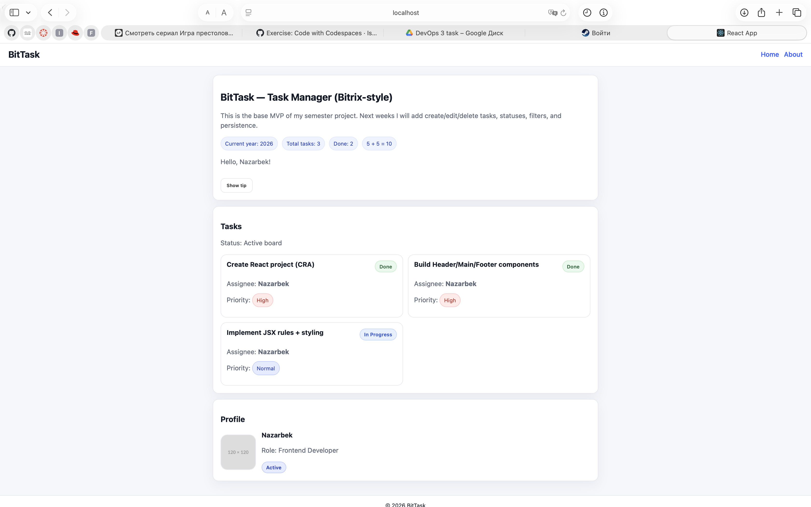

<div align="center">

# BitTask

**A fast, keyboard-first task manager built with React 19.**

*Final semester project — Frontend Development & React*

[Features](#-features) · [Quick start](#-quick-start) · [Architecture](#-architecture) · [Routes](#-routes) · [Testing](#-testing)

---

</div>

## ✨ What it is

BitTask is a production-style React SPA — not a tutorial app. Every feature was chosen to make real productivity feel effortless: a command palette, a drag-and-drop Kanban board, natural-language input, achievements, a GitHub-style activity heatmap, and a polished design system with full dark mode.

It demonstrates every requirement of the endterm rubric: nested + dynamic + protected routes, Context API state management, real REST integration, custom hooks with cleanup, encapsulated persistence, full UI/UX states, and unit tests.


---

## 🚀 Features

### Core
- **⌘K Command Palette** — search, navigate, and run any action without touching the mouse (Linear / Raycast style)
- **Drag-and-drop Kanban** — three columns (To Do / In Progress / Done) using native HTML5 DnD, no external library
- **List ↔ Board view** with persistent preference per user
- **Smart natural-language input** — type `design landing tomorrow !high #web @nazarbek` and BitTask extracts priority, tag, assignee, and due date
- **Full CRUD** — create, read, update, delete tasks via a real REST API
- **Live search + filters + sort** — by status, priority, due date, or alphabetically

### Dashboard
- **Productivity Score (0–100)** — composite metric of completion rate, recent activity, and streak, drawn as an animated SVG ring
- **Streak counter 🔥** — consecutive days with at least one task created
- **Activity heatmap** — GitHub-style 12-week contribution grid in pure SVG
- **Weekly bar chart** — tasks created per day, drawn in inline SVG
- **Priority breakdown** — stacked horizontal bar
- **Top tags cloud** — sized by usage frequency
- **Recent activity feed** — chronological log of creations and completions
- **Due-this-week panel** — colour-coded by urgency (overdue / today / upcoming)

### Profile & gamification
- **8 achievements** — unlock badges for streaks, completions, tags, and milestones
- **Customisable avatar** — 7 gradient colour themes
- **Editable bio** with character counter

### Settings
- **5 grouped sections** with iOS-style toggle switches and segmented controls
- **Export / Import tasks** as JSON
- **Danger zone** — reset preferences or wipe all tasks (with typed confirmation)

### UX polish
- **Light & Dark themes** with smooth transitions, persisted across sessions
- **Toast notifications** for every action (success / error / info)
- **Skeleton loaders** during data fetching
- **Empty states** with helpful copy and icons
- **Error states** with retry buttons
- **Confetti animation** when all tasks are complete 🎉
- **Animated greeting** that changes by time of day
- **404 page** with branded gradient design

### Authentication
- **Mock auth** via Context API (no backend required — type any username/password)
- **Protected routes** redirect to `/login` and remember the originally requested URL
- **Per-user task isolation** — your data, only yours

---

## 🛠 Tech stack

| Layer | Choice | Why |
|---|---|---|
| Framework | **React 19** | Modern hooks, concurrent rendering, latest APIs |
| Routing | **React Router 7** | Nested layouts, dynamic params, protected routes |
| State | **Context API** (Auth, Theme, Toast) | App scope is small — Redux would have been overhead |
| Fetching | Custom **`useFetch`** + service layer | Cancellable, race-safe, single source of loading/error |
| Persistence | Custom **`useLocalStorage`** | Single point that touches `localStorage` |
| DnD | **Native HTML5 DnD API** | Zero dependencies, easy to explain |
| Charts | **Inline SVG** | No chart library needed |
| Styling | **CSS variables + design tokens** | Full theme switch via one attribute on `<html>` |
| Testing | **Jest + React Testing Library** | 24 unit tests for pure logic |

---

## 📁 Project structure

```
src/
├── App.js                          ← routing + global providers + ⌘K hotkey
├── index.js                        ← React root
├── styles.css                      ← complete design system (~1500 lines)
│
├── components/
│   ├── Navbar.jsx                  ← glass-morphism top nav with ⌘K button
│   ├── CommandPalette.jsx          ← ⌘K modal with keyboard nav
│   ├── KanbanBoard.jsx             ← drag-and-drop board
│   ├── TaskList.jsx                ← list view container
│   ├── TaskItem.jsx                ← memoised list card
│   ├── TaskForm.jsx                ← smart input form with live preview
│   ├── TaskFilters.jsx             ← chips + sort dropdown
│   ├── TaskStats.jsx               ← pill stats
│   ├── SearchBar.jsx               ← live search input
│   ├── ViewToggle.jsx              ← List ↔ Board switch
│   ├── ProtectedRoute.jsx          ← auth gate with redirect-back
│   ├── Header.jsx · Footer.jsx
│
├── pages/
│   ├── Home.jsx                    ← landing (logged-out) + workspace (logged-in)
│   ├── About.jsx                   ← marketing-style product page
│   ├── Changelog.jsx               ← version timeline
│   ├── Shortcuts.jsx               ← keyboard reference
│   ├── TaskDetail.jsx              ← dynamic route /tasks/:id
│   ├── NotFound.jsx                ← custom 404
│   ├── auth/Login.jsx              ← split-screen login
│   └── dashboard/
│       ├── Overview.jsx            ← greeting + score ring + metrics + feed
│       ├── Activity.jsx            ← heatmap + charts + insights
│       ├── Profile.jsx             ← avatar, bio, 8 achievements
│       └── Settings.jsx            ← grouped settings + export/import
│
├── context/
│   ├── AuthContext.js              ← user, login, logout (persisted)
│   └── ThemeContext.js             ← theme + toggle (persisted)
│
├── hooks/
│   ├── useFetch.js                 ← data fetcher with cleanup + refetch
│   ├── useLocalStorage.js          ← persistent state hook
│   ├── useToast.js                 ← Context-based toast system
│   └── useKeyboardShortcut.js      ← global keyboard listener
│
├── services/
│   └── taskService.js              ← REST abstraction (GET / POST / PUT / DELETE)
│
└── utils/
    ├── smartParser.js              ← natural-language input parser
    ├── dateUtils.js                ← date formatting helpers
    ├── stats.js                    ← heatmap, streak, score calculations
    ├── achievements.js             ← 8 unlockable badge definitions
    └── *.test.js                   ← 24 unit tests
```

---

## 🚀 Quick start

### 1. Clone & install

```bash
git clone https://github.com/nazarbek111/bit-task.git
cd bit-task
npm install
```

### 2. Configure the API

BitTask talks to a JSON REST endpoint. The easiest option is [MockAPI](https://mockapi.io):

1. Create a resource called **`tasks`** with these fields:

| Field | Type |
|---|---|
| `title` | string |
| `priority` | string |
| `assignee` | string |
| `completed` | boolean |
| `status` | string |
| `tags` | array |
| `dueDate` | date |
| `createdAt` | date |
| `userId` | string |

2. Copy your endpoint URL.

3. Create `.env` in the project root:

```bash
cp .env.example .env
```

```env
REACT_APP_API_URL=https://your-id.mockapi.io/api/v1
```

> 💡 Alternative: run [`json-server`](https://github.com/typicode/json-server) locally with a `db.json` file.

### 3. Run

```bash
npm start          # dev server at http://localhost:3000
npm run build      # production build
npm test           # run all tests
```

### 4. Sign in

Type any username and password — auth is mocked via Context.

---

## 🎹 Keyboard shortcuts

| Key | Action |
|---|---|
| `⌘K` / `Ctrl+K` | Open command palette |
| `↑` / `↓` | Navigate palette |
| `Enter` | Run selected command |
| `Esc` | Close palette / modal |
| `Enter` (in task input) | Add task |
| Click checkbox | Toggle task done / active |
| Drag card | Move between Kanban columns |

A full reference lives on the in-app **/shortcuts** page.

---

## 🧠 Smart input syntax

Type in the task title field — BitTask parses it live and shows a preview:

| Symbol | Meaning | Example |
|---|---|---|
| `!high` `!normal` `!low` | Priority | `fix bug !high` |
| `#tag` | Add a tag | `study #math #exam` |
| `@name` | Assign to someone | `review pr @alice` |
| `today` / `tomorrow` | Due date | `call mom tomorrow` |
| `monday` … `sunday` | Next weekday | `meeting friday` |
| `12.05` / `12/05` | Specific date (DD.MM) | `pay bill 25.12` |

**Example:** `design landing tomorrow !high #web @nazarbek`
→ title: *"design landing"*, priority: *High*, tag: *web*, assignee: *nazarbek*, due: *tomorrow*

---

## 🗺 Routes

| Path | Type | Description |
|---|---|---|
| `/` | Public | Landing (logged-out) or Workspace (logged-in) |
| `/about` | Public | About / product page |
| `/changelog` | Public | Version timeline |
| `/shortcuts` | Public | Keyboard reference |
| `/login` | Public | Sign in |
| `/tasks/:id` | **Dynamic** | Task detail page |
| `/dashboard` | **Protected** | Redirects to `/login` if unauthenticated |
| `/dashboard` (index) | Nested | Overview — score, metrics, feed |
| `/dashboard/activity` | Nested | Heatmap + charts |
| `/dashboard/profile` | Nested | Avatar + achievements |
| `/dashboard/settings` | Nested | Preferences + export / import |
| `*` | Catch-all | Custom 404 |

---

## 🏗 Architecture

Small decisions, made deliberately.

### State
**Context API** for global concerns (auth, theme, toast). Local `useState` for everything else. Redux would have been overhead — there's no shared mutable data flow that needs it.

### Data fetching
One custom `useFetch` hook handles loading, error, and **race-condition safety** via a `cancelled` flag in cleanup. When dependencies change before a request resolves, the stale result is discarded.

```js
useEffect(() => {
    let cancelled = false;
    fetchFn().then((r) => { if (!cancelled) setData(r); });
    return () => { cancelled = true; };
}, [...deps]);
```

### Persistence
All `localStorage` access is encapsulated in a single `useLocalStorage` hook — no scattered `setItem` calls. Auth, theme, settings, profile customisation, and view preference all flow through it.

### API layer
Components never call `fetch` directly. Everything goes through `taskService` which normalises responses, derives the `status` field for backwards compatibility, and surfaces clean error messages.

### Performance
- `React.memo` on list rows — prevents re-rendering every task when one toggles
- `useCallback` for handlers passed to memoised children
- `useMemo` for derived data (filtered list, computed stats)
- Lazy `useState` initialisers avoid re-reading `localStorage` on every render

### Routing
- **Nested routes** for `/dashboard` with sub-pages rendered via `<Outlet />`
- **Dynamic route** at `/tasks/:id` consumed with `useParams`
- **Protected route** wrapper preserves the original URL via `location.state.from`

---

## 🧪 Testing

```bash
npm test
```

| File | Tests |
|---|---|
| `utils/smartParser.test.js` | 6 — natural-language extraction |
| `utils/dateUtils.test.js` | 7 — date formatting and status |
| `utils/stats.test.js` | 11 — heatmap, streak, score, tags |
| **Total** | **24 passing** |

All tests target pure functions so they run in <2 seconds with no setup.

---

## 🎁 Bonus criteria coverage

| Bonus | Status |
|---|---|
| Full backend integration | ✅ Real MockAPI / json-server |
| Performance optimization | ✅ `React.memo`, `useCallback`, `useMemo` |
| Unit tests | ✅ 24 passing tests |
| Live deployed app | ✅ Deployed on Vercel |
| Real-time updates | — |

---

## 📸 Screenshots

| | |
|---|---|
|  |  |
| Workspace with list view and stats | Kanban board with drag-and-drop |

---

## 👤 Author

**Nazarbek** — Frontend Development & React, semester project
Repository: [github.com/nazarbek111/bit-task](https://github.com/nazarbek111/bit-task)

---

<div align="center">

Built with ❤️ and ⌘K

</div>