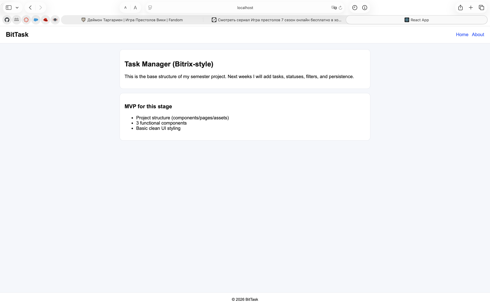

# BitTask

A fast, keyboard-first task manager built with **React 19**, **React Router 7**, and a custom design system.

> Final semester project for *Frontend Development & React · Bachelor Level*.
> Inspired by Linear, Raycast, and Vercel dashboard.



---

## ✨ Highlights

- **⌘K Command Palette** — search, navigate, and run actions without touching the mouse.
- **Drag-and-drop Kanban** — three columns (To Do / In Progress / Done) using native HTML5 DnD, no external library.
- **Smart input** — write `design landing tomorrow !high #web @nazarbek` and BitTask extracts priority, tag, assignee, and due date for you.
- **List view ↔ Board view** with persistent preference.
- **Productivity dashboard** with weekly bar chart and priority breakdown — drawn in inline SVG.
- **Light & Dark themes** with smooth transitions, persisted in `localStorage`.
- **Protected routes** with redirect-back to the originally requested page.
- **Real REST API** integration with loading / error / empty states everywhere.

---

## 🛠️ Tech stack

| Layer | Choice | Why |
|---|---|---|
| Framework | React 19 | Modern hooks, concurrent rendering |
| Routing | React Router 7 | Nested layouts, dynamic params, protected routes |
| State management | **Context API** (Auth, Theme, Toast) | App is small — Redux would be overhead. Auth and theme are global, everything else is local. |
| Data fetching | Custom `useFetch` hook + service layer | Cancellable, single source of error/loading state |
| Persistence | `useLocalStorage` hook | Encapsulated, type-safe, used by Auth/Theme/Settings |
| Styling | Plain CSS variables + design tokens | Full theme switch via one attribute on `<html>` |
| Drag & drop | Native HTML5 DnD API | Zero dependencies, easy to explain |
| Charts | Inline SVG | No chart library required |

---

## 📁 Project structure

```
src/
├── App.js                         ← routing + global providers + ⌘K hotkey
├── index.js                       ← React root
├── styles.css                     ← design system (CSS variables, dark theme)
│
├── components/
│   ├── Navbar.jsx                 ← top nav with active-link styling + ⌘K button
│   ├── CommandPalette.jsx         ← ⌘K modal with keyboard navigation
│   ├── KanbanBoard.jsx            ← drag-and-drop board
│   ├── TaskList.jsx               ← list view container
│   ├── TaskItem.jsx               ← list card (memoised)
│   ├── TaskForm.jsx               ← smart input form
│   ├── TaskFilters.jsx            ← chips + sort dropdown
│   ├── TaskStats.jsx              ← pill stats
│   ├── SearchBar.jsx              ← live search input
│   ├── ViewToggle.jsx             ← List ↔ Board switch
│   ├── ProtectedRoute.jsx         ← auth gate with redirect-back
│   ├── Header.jsx / Footer.jsx
│
├── pages/
│   ├── Home.jsx                   ← landing (logged-out) + workspace (logged-in)
│   ├── About.jsx
│   ├── TaskDetail.jsx             ← dynamic route /tasks/:id
│   ├── NotFound.jsx               ← 404
│   ├── auth/Login.jsx
│   └── dashboard/
│       ├── Overview.jsx           ← stat cards + progress bar
│       ├── Activity.jsx           ← SVG bar chart + priority chart
│       ├── Profile.jsx
│       └── Settings.jsx           ← uses useLocalStorage
│
├── context/
│   ├── AuthContext.js             ← user, login, logout
│   └── ThemeContext.js            ← theme + toggle
│
├── hooks/
│   ├── useFetch.js                ← data fetcher with cleanup + refetch
│   ├── useLocalStorage.js         ← persistent state
│   ├── useToast.js                ← Context-based toast system
│   └── useKeyboardShortcut.js     ← global keyboard listener
│
├── services/
│   └── taskService.js             ← REST abstraction (GET/POST/PUT/DELETE)
│
└── utils/
    ├── smartParser.js             ← natural-language input parser
    └── dateUtils.js               ← date formatting helpers
```

---

## 🚀 Setup

### 1. Clone & install

```bash
git clone https://github.com/nazarbek111/bit-task.git
cd bit-task
npm install
```

### 2. Configure the API

BitTask talks to a JSON REST endpoint. The easiest option is [MockAPI](https://mockapi.io/):

1. Create a resource called **`tasks`** with these fields:
   `title (string)`, `priority (string)`, `assignee (string)`, `completed (boolean)`,
   `status (string)`, `tags (array)`, `dueDate (date)`, `createdAt (date)`, `userId (string)`
2. Copy your endpoint URL.
3. Create `.env` in the project root:

```bash
cp .env.example .env
```

```env
REACT_APP_API_URL=https://your-id.mockapi.io/api/v1
```

> Alternative: run [`json-server`](https://github.com/typicode/json-server) locally on `http://localhost:3001`.

### 3. Run

```bash
npm start          # dev server at http://localhost:3000
npm run build      # production build
npm test           # tests
```

---

## 🎹 Keyboard shortcuts

| Key | Action |
|---|---|
| `⌘K` / `Ctrl+K` | Open command palette |
| `↑` / `↓` | Navigate palette |
| `Enter` | Run selected command |
| `Esc` | Close palette |

---

## 🧠 Smart input syntax

Type in the task title field — BitTask parses it live:

| Symbol | Meaning | Example |
|---|---|---|
| `!high` `!normal` `!low` | Priority | `fix bug !high` |
| `#tag` | Add a tag | `study #math #exam` |
| `@name` | Assign to someone | `review pr @alice` |
| `today` / `tomorrow` | Due date | `call mom tomorrow` |
| `monday` … `sunday` | Next weekday | `meeting friday` |
| `12.05` / `12/05` | Specific date | `pay bill 25.12` |

Example: `design landing tomorrow !high #web @nazarbek`

---

## 🧪 Routes

| Path | Description |
|---|---|
| `/` | Landing (logged-out) or Workspace (logged-in) |
| `/about` | About page |
| `/login` | Sign in |
| `/tasks/:id` | Dynamic task detail |
| `/dashboard` | Protected — redirects to `/login` if needed |
| `/dashboard/overview` | (index) Key metrics |
| `/dashboard/activity` | Weekly chart + priority chart |
| `/dashboard/profile` | User profile |
| `/dashboard/settings` | App preferences |
| `*` | Custom 404 |

---

## 🧬 Architecture notes

- **No prop drilling** — global concerns live in Context (`AuthContext`, `ThemeContext`, `ToastProvider`).
- **Service layer** keeps every `fetch` call out of components.
- **`useFetch` cleanup** — a `cancelled` flag prevents stale responses from overwriting newer data when dependencies change.
- **`React.memo`** on `TaskItem` avoids re-rendering hundreds of list rows when only one toggles.
- **`useMemo` / `useCallback`** in `Home.jsx` stabilize handlers passed to memoised children.
- **`useLocalStorage`** is the single point that touches `localStorage`, keeping persistence logic encapsulated.

---

## 📸 Screenshots

See the `/screenshots` folder for previews of the dashboard, kanban, command palette, and dark mode.
